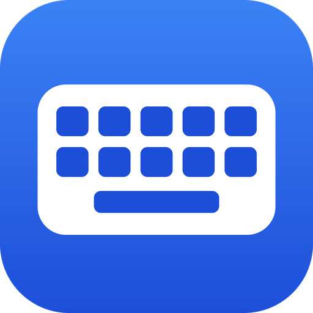
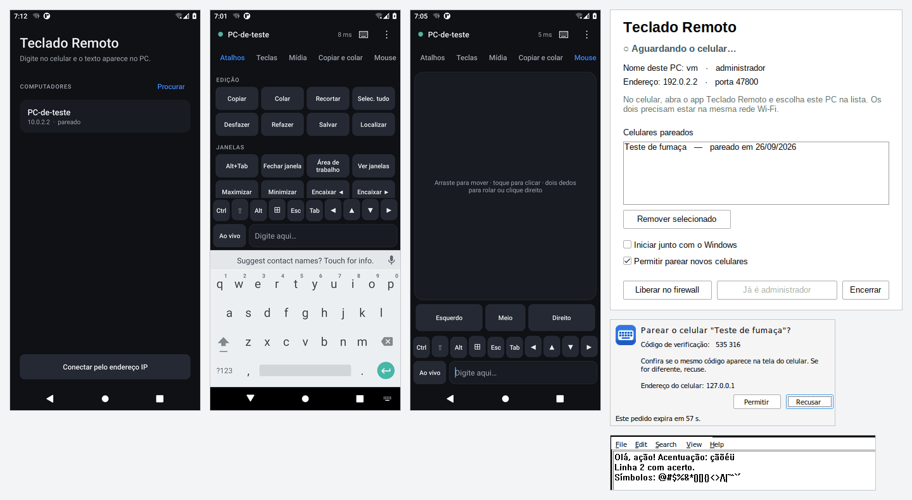

# Teclado Remoto

Use o teclado do celular (Android) para digitar no computador (Windows), como se o
celular fosse um teclado do PC. Você digita com o teclado que já usa no celular (Gboard,
Samsung, SwiftKey…) e o texto aparece no PC na hora — com acentos, emoji, atalhos
(Ctrl+C, Ctrl+V, Alt+Tab…), teclas especiais, controles de mídia, troca de área de
transferência e um touchpad para o mouse.

<p align="center"></p>



<sub>Capturas reais dos testes: o app no Android e o programa do PC, com o texto digitado
pelo celular chegando ao Bloco de Notas.</sub>

## Destaques

- **Leve** — o app tem ~80 KB e o programa do PC ~0,7 MB, sem instalador, sem .NET,
  Java ou bibliotecas extras. Nenhum dos dois usa CPU enquanto você não digita.
- **Rápido** — conexão TCP direta na rede local, sem atraso de Nagle, uma mensagem por
  pacote e o Wi‑Fi do celular em modo de baixa latência enquanto o app está aberto.
  A latência aparece no topo da tela.
- **Preciso** — o texto chega ao PC como Unicode, então “ç”, “ã”, “é” e emoji saem certos
  em qualquer layout de teclado do PC (ABNT2, US…). Quando o teclado do celular corrige
  uma palavra, o PC recebe só os Backspaces e letras necessários. A ordem é garantida e,
  se a conexão cair, o PC solta qualquer tecla que tenha ficado pressionada.
- **Seguro** — cada celular precisa ser autorizado no PC comparando um código de 6
  dígitos, e tudo é criptografado (ECDH P‑256 + AES‑256‑GCM). Outra pessoa na mesma
  rede não consegue digitar no seu PC nem ver o que você digita.

## Instalação

Os arquivos prontos saem do GitHub Actions: aba **Actions → Teclado Remoto → última
execução → Artifacts** (`TecladoRemoto-Windows` e `TecladoRemoto-Android`). Se houver
uma versão publicada, eles também ficam em **Releases**.

### No PC (Windows 10 ou 11)

1. Rode o `TecladoRemoto.exe` (não precisa instalar; guarde-o numa pasta fixa).
   - Se aparecer “O Windows protegeu o computador”, clique em **Mais informações →
     Executar assim mesmo** (o .exe não tem assinatura digital paga).
2. Quando o **Firewall do Windows** perguntar, clique em **Permitir**. Se clicou em
   Cancelar sem querer, use o botão **Liberar no firewall** na janela do programa.
3. O programa fica no ícone da bandeja, perto do relógio (azul = celular conectado,
   cinza = aguardando). Marque **Iniciar junto com o Windows** se quiser.

### No celular (Android 5.0 ou mais novo)

1. Instale o `TecladoRemoto.apk` (o Android vai pedir para permitir instalar apps desta
   fonte).
2. Abra o app: o PC aparece sozinho na lista (celular e PC precisam estar na mesma rede
   Wi‑Fi). Toque nele.
3. Confira se o código de 6 dígitos no celular é igual ao do aviso no PC e clique em
   **Permitir** no PC. Pronto — das próximas vezes ele conecta sozinho ao abrir o app.

## Como usar

| Na tela do app | O que faz |
|---|---|
| **Campo de texto + teclado do celular** | Digite normalmente; o texto vai para onde o cursor estiver no PC. |
| **Ao vivo / Direto / Enviar ⏎** | *Ao vivo*: aparece no PC enquanto você digita, com sugestões e correção. *Direto*: sem sugestões, cada tecla vai exatamente como digitada (senhas, código, jogos). *Enviar*: escreve a frase no celular e manda de uma vez. |
| **Ctrl ⇧ Alt ⊞** | Um toque vale para a próxima tecla (ex.: Ctrl e depois `c` = Ctrl+C). Dois toques ou segurar = trava. |
| **Esc Tab ◀ ▲ ▼ ▶** | Sempre à mão; segure as setas para repetir. |
| **Atalhos** | Copiar, colar, desfazer, salvar, Alt+Tab, Alt+F4, área de trabalho, abas do navegador, zoom, captura de tela, bloquear o PC… |
| **Teclas** | F1–F12, Home/End, PgUp/PgDn, Insert/Delete, PrtSc, Caps Lock e setas. |
| **Mídia** | Volume, mudo, tocar/pausar, próxima/anterior. |
| **Copiar e colar** | Colar no PC o que foi copiado no celular, digitar esse texto letra por letra, ou trazer para o celular o que está copiado/selecionado no PC. |
| **Mouse** | Arraste para mover, toque para clicar, dois dedos para rolar, toque com dois dedos = clique direito. Segure “Esquerdo” e arraste para selecionar. |

**Alt+Tab:** toque para abrir a troca de janelas e toque de novo para ir para a próxima;
pare de tocar e a janela escolhida abre (Enter escolhe na hora, Esc cancela).

No menu **⋮**: trocar de computador, soltar todas as teclas, manter a tela ligada,
vibração e usar os **botões de volume do celular** para o volume do PC.

## Problemas comuns

- **O PC não aparece na lista** — confira se os dois estão no mesmo Wi‑Fi (redes de
  visitantes costumam isolar os aparelhos), clique em **Liberar no firewall** na janela
  do PC e, no Windows, deixe a rede como **Privada**. Dá para conectar direto pelo
  endereço mostrado na janela do PC em **Conectar pelo endereço IP**.
- **Digita em tudo, menos no Gerenciador de Tarefas / instaladores** — o Windows impede
  programas comuns de digitar em janelas de administrador. Clique em **Rodar como
  administrador** na janela do PC (o celular também avisa quando isso acontece).
- **Tela de bloqueio, pedido do UAC e Ctrl+Alt+Del** não aceitam teclas simuladas —
  é uma proteção do próprio Windows. Alguns jogos com anti‑cheat também as ignoram.
- **Atraso** — prefira Wi‑Fi de 5 GHz e o PC no cabo; a latência normal fica na casa de
  poucos milissegundos.
- **Remover um celular** — selecione-o na janela do PC e clique em **Remover
  selecionado**; no celular, segure o nome do PC na lista e toque em Esquecer.

## Como funciona

```
 Celular (Kotlin, sem bibliotecas)                 PC (Rust + API do Windows)
 ┌──────────────────────────────┐   UDP 47810     ┌──────────────────────────────┐
 │ teclado do celular → campo    │ ── "quem é?" ─► │ responde nome e porta        │
 │ diff do texto → Backspaces +  │                 │                              │
 │ texto; atalhos, mouse, mídia  │   TCP 47800     │ SendInput: Unicode, teclas,  │
 │ fila única (ordem garantida)  │ ══ AES-256 ═══► │ mouse; área de transferência │
 └──────────────────────────────┘                 └──────────────────────────────┘
```

O protocolo está descrito em [`docs/PROTOCOLO.md`](docs/PROTOCOLO.md).

```
teclado-remoto/
├── android/        app Android
│   ├── core/       protocolo, criptografia, conexão e diff de texto (Kotlin puro, testado na JVM)
│   └── app/        interface (Views nativas, sem AndroidX)
├── pc-windows/     programa do PC em Rust (janela, bandeja, SendInput) + modo sem interface p/ testes
├── docs/           protocolo e ícone
└── tools/          teste ponta a ponta e gerador de ícones
```

## Para desenvolver

**PC** (Rust estável):

```powershell
cd teclado-remoto/pc-windows
cargo test
cargo build --release          # gera target/release/teclado-remoto.exe
```

No Linux também dá para gerar o .exe: `rustup target add x86_64-pc-windows-gnu`,
instalar o `mingw-w64` e usar `cargo build --release --target x86_64-pc-windows-gnu`.
Fora do Windows o programa roda em modo sem interface, imprimindo as teclas que
mandaria — é o que o teste ponta a ponta usa.

**Android** (JDK 17+ e Android SDK 36):

```powershell
cd teclado-remoto/android
./gradlew :core:test :app:lintRelease :app:assembleRelease
# APK em app/build/outputs/apk/release/app-release.apk
```

**Teste ponta a ponta** (sobe o servidor do PC e conversa com ele usando o código do app):
`teclado-remoto/tools/e2e.sh`.

**Assinatura do APK:** para que qualquer build atualize o app já instalado, o projeto usa
a chave de desenvolvimento `android/keystore/teclado-remoto-dev.jks` (senha
`tecladoremoto`). Para publicar com uma chave só sua, crie os secrets
`TRK_KEYSTORE_BASE64`, `TRK_KEYSTORE_PASSWORD`, `TRK_KEY_ALIAS` e `TRK_KEY_PASSWORD`
no repositório (ou as variáveis `TRK_KEYSTORE*` localmente) — trocar de chave exige
desinstalar o app uma vez.

**Publicar uma versão:** crie e envie uma tag `teclado-remoto-v1.0.0`; o GitHub Actions
compila tudo e cria a Release com o `.exe` e o `.apk`.
